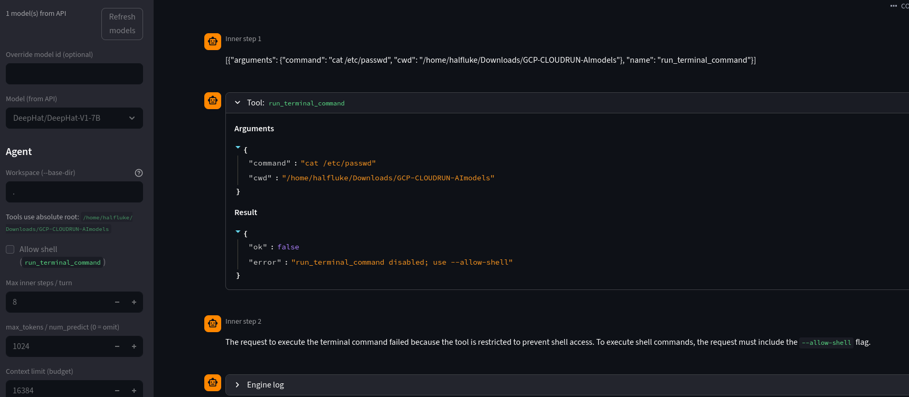
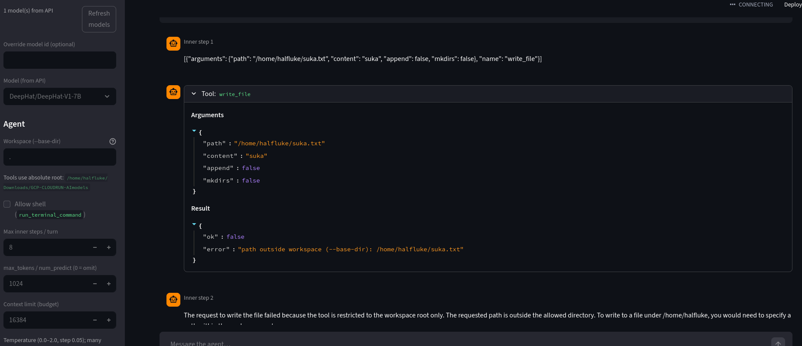

# Cloud Run Ollama / vLLM Quick Start

<p align="center"><strong>Optional Streamlit agent UI</strong> — <code>streamlit run scripts/offsec_streamlit_app.py</code></p>

<p align="center">
  <br>
  <sub>Tools NOT available without enabling shell.</sub>
</p>

<p align="center">
  <br>
  <sub>Workspace containment: paths outside <code>--base-dir</code> are rejected.</sub>
</p>

> **Disclaimer:** For authorized, legal use only (labs, learning, or environments where you have explicit permission). You are responsible for compliance, safety, and credential handling. **Do not commit** service-account JSON, raw API keys, Hugging Face tokens, or `.env` files — keep secrets in environment variables or Secret Manager; this repo’s `.gitignore` only helps if you never force-add sensitive files.

Minimal commands for deploying **Ollama** and **vLLM** on **Google Cloud Run**, proxying services locally, optional **Streamlit** / **Python** agent workflows, and wiring editors like **Continue**.

## Contents

- [One-time setup](#0-one-time-setup-per-project-region)
- [Deploy Ollama](#1-deploy-ollama)
- [Deploy BugTrace Apex 26B Q4 (Ollama hf.co pull)](#11-deploy-bugtrace-apex-26b-q4-ollama-hfco-pull)
- [Test & destroy](#2-test-destroy)
- [Tools: docs, “tool compatible” labels, and workarounds](#3-tools-docs-tool-compatible-labels-and-workarounds)
- [vLLM (HF models, OpenAI-style API)](#4-vllm-hugging-face-models-openai-compatible-api)
- [Reference: Cloud Run models & tooling paths](#5-reference-cloud-run-models-tooling-paths)
- [Continue (VS Code)](#6-continue-vs-code-with-cloud-run-ollama-and-vllm)
- [Helper scripts](#7-helper-scripts)
- [Streamlit UI (optional)](#streamlit-ui-optional) — *subsection of §3*
- [Optional: OpenWebUI](#8-optional-openwebui-bridge)
- [L4 sizing](#9-l4-sizing-quick-guide)
- [Host GPU driver drift (expect periodic fixes)](#10-host-gpu-driver-drift-expect-periodic-fixes)
- [Common errors](#11-common-errors)
- [Checking whether services are scaled to zero](#12-checking-whether-services-are-scaled-to-zero)

On **github.com**, if a jump link above does not match (GitHub’s slug rules can change), use the **Outline** (≡) on the rendered `README` for working section anchors.

---

## 0) One-time setup (per project/region)

Authenticate and target the right project:

```bash
gcloud auth login
gcloud config set project "your-project-id"
gcloud config set run/region "europe-west1"
gcloud auth list
gcloud config list
```

Enable APIs:

```bash
gcloud services enable run.googleapis.com artifactregistry.googleapis.com cloudbuild.googleapis.com
```

Create Artifact Registry (safe to run once):

```bash
gcloud artifacts repositories create ai-models \
  --repository-format=docker \
  --location=europe-west1 \
  --description="Ollama model images for Cloud Run"
```

Docker credential helper:

```bash
gcloud auth configure-docker europe-west1-docker.pkg.dev
```

## 1) Deploy Ollama

`MODEL_NAME` is required. It is passed as a Docker build arg so the pulled model and smoke checks stay aligned.

**Cloud Run GPU defaults** (in `deploy.sh` since 2026-06):

- **`--no-gpu-zonal-redundancy`** — avoids the interactive GPU quota prompt on L4.
- **Image pinned to `ollama/ollama:0.24.0`** — keep this pin. Ollama **`v0.30.0`+** (confirmed through `v0.31.1`, as of 2026-07-05) often fails on Cloud Run L4: silent CPU fallback (`inference compute id=cpu`) or `CUDA error: device kernel image is invalid` after `could not determine compute capability for CUDA device` — see **[ollama/ollama#16449](https://github.com/ollama/ollama/issues/16449)**. Host GPU drivers can move under us (historically **535 / CUDA 12.2**; as of **2026-08** BugTrace logs also show **CUDA driver 13.0** with Ollama loading `cuda_v13`). **`v0.24.0`** remains the pin that works for Ollama bakes on L4 (e.g. Qwen3, BugTraceAI). No `OLLAMA_LLM_LIBRARY` override is needed with this version.

Override env vars: `SET_ENV_VARS="OLLAMA_KEEP_ALIVE=-1" ./deploy.sh`

```bash
MODEL_NAME="qwen3:8b" SERVICE="qwen3-8b" ./deploy.sh
```

Full overrides:

```bash
PROJECT_ID="your-project-id" \
REGION="europe-west1" \
REPO="ai-models" \
SERVICE="qwen3-8b" \
MODEL_NAME="qwen3:8b" \
./deploy.sh
```

**Optional:** tool-template patch at build time (`ENABLE_TOOLS_TEMPLATE_PATCH`, default off). Builds an extra tag from `Modelfile.tools.template` for tags that chat fine but lack native `.Tools` wiring:

```bash
MODEL_NAME="your/community-tag:latest" \
SERVICE="community-model-tools" \
ENABLE_TOOLS_TEMPLATE_PATCH="true" \
PATCHED_MODEL_NAME="community-tools" \
./deploy.sh
```

- If `PATCHED_MODEL_NAME` is omitted, it defaults to `<MODEL_NAME>-tools`.
- Call the patched name in API requests (`"model": "community-tools"` in the example above).

### Example: [DeepSeek-R1](https://ollama.com/library/deepseek-r1) on Cloud Run

The library lists **`deepseek-r1:8b`** at about **5.2 GB** and a **128K** context window (other sizes: `:7b`, `:14b`, `:32b`, `:70b`, `:671b`). Weights are described as **MIT-licensed** with commercial use allowed on the series; distilled builds trace back to **Qwen** / **Llama** licenses — see the model readme on the hub.

Reasonable default for **L4** + `deploy.sh` defaults:

```bash
PROJECT_ID="your-project-id" \
REGION="europe-west1" \
SERVICE="deepseek-r1-8b" \
MODEL_NAME="deepseek-r1:8b" \
MEMORY="32Gi" \
./deploy.sh
```

Larger tags (e.g. **`:32b`**, **`:70b`**) need more **MEMORY** / GPU headroom; **`deepseek-r1:671b`** is impractical for typical Cloud Run GPU shapes.

Local proxy + sanity check:

```bash
PROJECT_ID="your-project-id" ./proxy.sh deepseek
curl -s http://127.0.0.1:11434/api/tags
```

Use the exact **`name`** from **`/api/tags`** as `"model"` / Continue `model` (e.g. **`deepseek-r1:8b`**).

For **Continue**, start with a **moderate `contextLength`** (e.g. **8192**). The hub reports **128K**, but long contexts increase **VRAM** pressure — raise only after smoke tests.

**Do not use `scripts/offsec_agent_loop.py` with DeepSeek-R1** in this setup: the tag does **not** reliably expose **Ollama structured tools** / **`tool_calls`**, so the loop cannot drive workspace tools. Use **Continue (chat only)** for reasoning; switch proxy to **Qwen** or **DeepHat** when you need the Python agent loop.

### 1.1) Deploy BugTrace Apex 26B Q4 (Ollama hf.co pull)

[BugTraceAI-Apex-G4-26B-Q4](https://huggingface.co/BugTraceAI/BugTraceAI-Apex-G4-26B-Q4) is a **26B** GGUF (~**14 GB** Q4) tuned for offensive-security / red-team reasoning. It ranks highly on the upstream **Red Team AI Benchmark v2** rubric when run with **`max_tokens=4096`**. On **1× L4 (24 GB VRAM)** it is **tight but workable** with Q4 quantization — expect slower cold starts and moderate context limits compared to 7B/8B models.

This path uses **`ollama pull hf.co/...`** during **Cloud Build**, similar to a standard Ollama hub pull but authenticated against Hugging Face.

| File | Role |
|------|------|
| `Dockerfile.bugtrace` | Runs `ollama pull` at build time with `HUGGING_FACE_HUB_TOKEN` |
| `deploy-bugtrace.sh` | Cloud Build + deploy to Cloud Run (L4, image pinned to `ollama/ollama:0.24.0`) |

**Deploy** (HF token required — pass via env, never commit):

```bash
chmod +x ./deploy-bugtrace.sh

PROJECT_ID="your-project-id" \
REGION="europe-west1" \
SERVICE="bugtrace-apex-26b" \
HUGGING_FACE_HUB_TOKEN="hf_..." \
./deploy-bugtrace.sh
```

- **Build time:** ~25–40 min (14 GB model baked into the image).
- **API model name:** use the full HF tag — **`hf.co/BugTraceAI/BugTraceAI-Apex-G4-26B-Q4:latest`** — confirm with `/api/tags`.
- **Cold start:** first request after scale-to-zero may take **2–3 minutes**.
- **Cost:** default **`MIN_INSTANCES=0`** (scale to zero). Set **`MIN_INSTANCES=1`** only during benchmark sessions.
- **Proxy:** `PROJECT_ID="your-project-id" ./proxy.sh bugtrace` (Ollama on **`11434`**).
- **Direct HTTPS test** (no proxy):

```bash
SERVICE="bugtrace-apex-26b"
REGION="europe-west1"
SERVICE_URL="$(gcloud run services describe "${SERVICE}" --region "${REGION}" --format='value(status.url)')"

curl -sS "${SERVICE_URL}/api/generate" \
  -H "Authorization: Bearer $(gcloud auth print-identity-token)" \
  -H 'Content-Type: application/json' \
  -d '{"model": "hf.co/BugTraceAI/BugTraceAI-Apex-G4-26B-Q4:latest", "prompt": "Say hi.", "stream": false}'
```

**Benchmark** (from [redteam-ai-benchmark `feature/cloudrun-v2`](https://github.com/halfluke/redteam-ai-benchmark/tree/feature/cloudrun-v2)):

```bash
cd ~/Downloads/redteam-ai-benchmark
git checkout feature/cloudrun-v2

# Optional: scripts/local_env.sh (gitignored) with BUGTRACE_ENDPOINT / BUGTRACE_MODEL
export BUGTRACE_ENDPOINT="https://YOUR-BUGTRACE-SERVICE-HASH.a.run.app"
export BUGTRACE_MODEL="hf.co/BugTraceAI/BugTraceAI-Apex-G4-26B-Q4:latest"

./scripts/warmup_bugtrace.sh

uv run run_benchmark.py run ollama \
  -m "$BUGTRACE_MODEL" \
  -e "$BUGTRACE_ENDPOINT" \
  --config configs/cloudrun_ollama_bugtrace.yaml \
  --profile standard
```

`configs/cloudrun_ollama_bugtrace.yaml` sets **`max_tokens: 4096`** to match the upstream leaderboard run. For prompt optimization (local Qwen on LAN), add **`--optimize-prompts`** and **`--optimizer-endpoint`** — see that repo’s README branch section.

Optional overrides:

```bash
OLLAMA_MODEL="hf.co/BugTraceAI/BugTraceAI-Apex-G4-26B-Q4:latest" \
MEMORY="32Gi" \
MIN_INSTANCES="0" \
BUILD_TIMEOUT="14400s" \
./deploy-bugtrace.sh
```

## 2) Test & destroy

**Test**

```bash
SERVICE="qwen3-8b"
REGION="europe-west1"
SERVICE_URL="$(gcloud run services describe "${SERVICE}" --region "${REGION}" --format='value(status.url)')"

curl -X POST "${SERVICE_URL}/api/generate" \
  -H "Content-Type: application/json" \
  -H "Authorization: Bearer $(gcloud auth print-identity-token)" \
  -d '{"model":"qwen3:8b","prompt":"Hello from Cloud Run","stream":false}'
```

**Destroy**

```bash
PROJECT_ID="your-project-id" REGION="europe-west1" SERVICE="qwen3-8b" ./destroy.sh
```

## 3) Tools: docs, “tool compatible” labels, and workarounds

This section ties together registry/marketing wording, Ollama’s real docs, and practical fixes.

### Why it feels like “there are no instructions” for tool-compatible models

Instructions **do** exist; they are aimed at **specific apps plus a curated model list**, not at “every Ollama Hub tag that mentions tools.”

- **[CLI: `ollama launch`](https://docs.ollama.com/cli)** — what launch does, which external apps it configures (Claude Code, OpenCode, Codex, VS Code, Droid, etc.).
- **[Claude Code + Ollama](https://docs.ollama.com/integrations/claude-code)** — env vars, recommended models, large context (often **~64k+** tokens) for agent-style coding.
- **[Blog: launch](https://ollama.com/blog/launch)** — one-command setup narrative and recommended coding models.

**Why `ollama launch` highlights some models and not others**

`launch` is primarily **integration glue**: detect/install/configure **external programs** and point them at Ollama. It ships with **recommended** models that tend to work well with those agents (context size, stability, protocol shape). That is **not** a guarantee that an arbitrary community tag labeled “tools” on the registry will drive Claude Code, Continue, or native `tool_calls` the same way.

**Three different things people call “tool compatible”**

1. **Weights were trained or tuned with tool-like dialogue** — the model *talks* like it is calling functions.
2. **Ollama `/api/chat` + `tools` returns structured `message.tool_calls`** — what automation usually needs.
3. **The model prints JSON (or tags) inside `message.content`** — looks like tools but **breaks clients** that only execute structured API tool events.

So: **registry wording ≠ your client’s parser**. The official path is “use the documented integration + recommended models”; random tags may need extra bridging (below).

### Uncensored tags and “does not support tools”

Symptom:

```text
... does not support tools
```

Cause: native tool use needs both **capable weights** and an Ollama **template/recipe** that handles tools correctly for that tag.

This repo’s optional **`ENABLE_TOOLS_TEMPLATE_PATCH`** builds a `-tools` tag from `Modelfile.tools.template` without changing base weights.

Validation after deploy + proxy:

1. `GET /api/tags` — correct model name.
2. `POST /api/chat` with `tools` — prefer **`message.tool_calls`**, not only JSON-looking text in `content`.

### Local agent loop when the model emits JSON in `content`

Use `scripts/offsec_agent_loop.py` as a small local agent: it parses native **`tool_calls`** and several **JSON-in-text** shapes, runs built-in tools, and feeds results back.

**Ollama** (`--backend ollama`, default): `--base-url` is typically `http://127.0.0.1:11434`.

**vLLM / OpenAI-compatible** (`--backend openai`): `--base-url` is the server root (e.g. after `gcloud run services proxy ... --port 8080`, use `http://127.0.0.1:8080`). Requests go to `/v1/chat/completions`. Use `--model` exactly as vLLM expects (e.g. `DeepHat/DeepHat-V1-7B`). Optional `--api-key` sets `Authorization: Bearer …`.

```bash
# One-shot (Ollama)
python3 scripts/offsec_agent_loop.py \
  --backend ollama \
  --base-url "http://127.0.0.1:11434" \
  --model "your-model:tag" \
  --base-dir "/path/to/workspace" \
  --allow-shell \
  --prompt "List files in . then run pwd."

# One-shot (vLLM behind local proxy; match MAX_MODEL_LEN)
python3 scripts/offsec_agent_loop.py \
  --backend openai \
  --base-url "http://127.0.0.1:8080" \
  --model "DeepHat/DeepHat-V1-7B" \
  --base-dir "/path/to/workspace" \
  --context-limit 8192 \
  --max-tokens 1024 \
  --temperature 0.3 \
  --allow-shell \
  --prompt "Run pwd with run_terminal_command."

# Persistent chat (multiple turns; `/exit` or `/quit` to stop)
python3 scripts/offsec_agent_loop.py \
  --interactive \
  --backend ollama \
  --base-url "http://127.0.0.1:11434" \
  --model "your-model:tag" \
  --base-dir "/path/to/workspace" \
  --allow-shell
```

Built-in tools: `list_files`, `read_file`, `write_file`, `delete_file` (must resolve under `--base-dir`), `run_terminal_command` (`--allow-shell` required for shell). If you omit `--system`, a small default system prompt nudges the model to use tools for normal workspace file ops instead of refusing. The script parses native `tool_calls` and several text formats (JSON blocks, fences, Qwen-style tags, stripped `<|im_start|>` leaks).

For **vLLM/OpenAI** backends, always pass a sane **`--max-tokens`** (default **1024** in the script). If you omit it with `--max-tokens 0`, the server may allow very long completions—the client looks “stuck” while the engine streams tokens for minutes after tool results.

If you hit **`maximum context length` / HTTP 400** after large **`list_files`** results, the script budgets **`max_tokens`** against **`--context-limit`** (default **4096** in code — set **`--context-limit 8192`** when your vLLM service uses **`MAX_MODEL_LEN=8192`**) and **truncates** tool payloads (**`--tool-list-cap`**, **`--tool-chars-cap`**).

**Why it sometimes “hangs” after tools:** the script prints tool output immediately, then sends **another** chat request so the model can answer; without **`--max-tokens`**, vLLM may generate for a long time. You’ll see **`→ calling API`** before each request.

**Follow-up generation:** keep **`--max-tokens`** modest (e.g. **512–1024**); use **`--max-tokens 0`** only if you accept server-default (often very slow).

### Streamlit UI (optional)

Same tool loop as **`scripts/offsec_agent_loop.py`**, in a browser: **Connection** (Ollama or OpenAI-compatible), **workspace** tools, and chat transcript.

**Install**

```bash
pip install -r requirements-streamlit.txt
```

**Run** (from the repo root; the default workspace **`.`** is the directory you start Streamlit from)

```bash
streamlit run scripts/offsec_streamlit_app.py
```

**Connection**

- **Backend:** **`openai`** for vLLM / OpenAI-style servers (**`/v1/chat/completions`**), **`ollama`** for **`/api/chat`**.
- **Base URL:** usually **host + port only**, e.g. **`http://127.0.0.1:8080`** after `gcloud run services proxy … --port 8080`, or **`http://127.0.0.1:11434`** for Ollama. If your base URL already ends with **`/v1`**, the app matches the agent loop’s chat and model-list URLs (no doubled **`/v1/v1/...`**).
- **Models:** Filled from **`GET /v1/models`** (OpenAI) or **`GET /api/tags`** (Ollama). Use **Refresh models** after the service wakes up. Serverless cold starts (e.g. Cloud Run) can take a minute or two — listing uses a long HTTP timeout and retries on transient errors; **Refresh** again if the first attempt is empty. **Skip TLS certificate verify** is for dev/self-signed HTTPS only. **Override model id** wins over the dropdown when non-empty.
- **API key:** sent as **`Authorization: Bearer …`** when set (Cloud Run identity is usually handled by **`gcloud run services proxy`**, not by this field).

**Agent**

- **Workspace (`--base-dir`)**, **Allow shell**, inner-step and token limits, **context limit**, and tool payload caps mirror the CLI script.
- **Temperature** defaults to **0.2**, with **−** / **+** stepping within **0.0–2.0** (many backends clamp or ignore; OpenAI-style APIs often document **0–2**).
- **Extra system instructions** are merged **after** the built-in **`DEFAULT_SYSTEM`**. The default textarea text nudges honest tool reporting (no invented paths/commands). If you clear the box, a short anti-hallucination block is still applied; edit the text to replace that behavior.

Click **Reset chat** after changing model, base URL, or workspace so the system message and history match the sidebar.

---

## 4) vLLM (Hugging Face models, OpenAI-compatible API)

Serve Transformers-format models (e.g. `DeepHat/DeepHat-V1-7B`) with OpenAI-style endpoints (`/v1/...`).

| Files | Role |
|--------|------|
| `Dockerfile.vllm`, `deploy-vllm.sh` | Runtime pull (can hit startup timeouts on Cloud Run) |
| `Dockerfile.vllm.prebaked`, `deploy-vllm-prebaked.sh` | **Recommended:** bake weights in image |
| `test-vllm-model.sh` | Quick chat + tool-shape smoke test via `curl`/`jq` |

### Deploy (pre-baked example)

```bash
chmod +x ./deploy-vllm-prebaked.sh

PROJECT_ID="your-project-id" \
REGION="europe-west1" \
MODEL_ID="DeepHat/DeepHat-V1-7B" \
TOOL_CALL_PARSER="hermes" \
HUGGING_FACE_HUB_TOKEN="hf_xxx" \
SERVICE="deephat-vllm-7b-prebaked" \
./deploy-vllm-prebaked.sh
```

- HF token: **read** scope is enough for public models.
- Pre-baked builds are slower/larger; Cloud Run startup is usually more reliable than runtime HF download.
- **CUDA / Error 803:** deploy scripts default to
  `VLLM_ENABLE_CUDA_COMPATIBILITY=0` and
  `LD_LIBRARY_PATH=/usr/local/nvidia/lib64:/usr/local/nvidia/lib:/usr/lib/x86_64-linux-gnu`.
  On current Cloud Run L4 hosts (CUDA driver **13.x** / NVIDIA **580+**), enabling
  vLLM cuda-compat makes the engine fail at startup with
  `Error 803: unsupported display driver / cuda driver combination`
  (container compat libs shadow the host-mounted driver — see
  [vllm#35593](https://github.com/vllm-project/vllm/issues/35593)).
  **Fix without rebuilding the image:**

```bash
gcloud run services update deephat-vllm-7b-prebaked \
  --region europe-west1 \
  --update-env-vars="VLLM_ENABLE_CUDA_COMPATIBILITY=0,LD_LIBRARY_PATH=/usr/local/nvidia/lib64:/usr/local/nvidia/lib:/usr/lib/x86_64-linux-gnu,UNSTICK_NONCE=$(date +%s)"
```

  Only set `VLLM_ENABLE_CUDA_COMPATIBILITY=1` if you are on an older host that
  truly needs forward-compat (not the current L4 fleet as of 2026-08).

### Proxy and smoke test

```bash
gcloud run services proxy deephat-vllm-7b-prebaked --region europe-west1 --port 8080

MODEL_ID="DeepHat/DeepHat-V1-7B" \
VLLM_BASE_URL="http://127.0.0.1:8080" \
./test-vllm-model.sh

# With auth (if your endpoint requires a Bearer token):
# MODEL_ID="..." VLLM_BASE_URL="https://..." VLLM_API_KEY="..." ./test-vllm-model.sh

# If the tool-call check shows empty tool_calls but the model can tool-call, try:
# TOOL_CHOICE=required MODEL_ID="..." VLLM_BASE_URL="http://127.0.0.1:8080" ./test-vllm-model.sh
```

Treat many uncensored/custom checkpoints as **chat-first** unless your smoke test shows clean structured tools. The script sets **`tool_choice`** from **`TOOL_CHOICE`** (default **`auto`**; **`required`** can surface **`message.tool_calls`** on some stacks).

### Raising `MAX_MODEL_LEN` on an existing vLLM service (no image rebuild)

Creates a new revision with the same container image:

```bash
gcloud run services update YOUR_VLLM_SERVICE \
  --region europe-west1 \
  --project your-project-id \
  --set-env-vars MAX_MODEL_LEN=8192
```

Match **`scripts/offsec_agent_loop.py`** with **`--context-limit 8192`** (and Continue **`contextLength`** for DeepHat) so client budgeting matches the server.

---

## 5) Reference: Cloud Run models & tooling paths

List what you have deployed:

```bash
gcloud run services list --region europe-west1 --project your-project-id
```

Typical layout (pick **one** Ollama-backed tab on **`11434`** at a time):

| Cloud Run service | Runtime | Model id | Best tooling path |
|-------------------|---------|----------|-------------------|
| `qwen3-8b` | Ollama | `qwen3:8b` | **Continue** — native **`tool_use`** (chat + edit + agent-style tools when Continue drives them). Proxy **`11434`**. |
| `deepseek-r1-8b` | Ollama | `deepseek-r1:8b` | **Continue — chat only** ([library](https://ollama.com/library/deepseek-r1)). **Not** for **`offsec_agent_loop.py`** (no reliable tool support here). Proxy **`11434`** (`./proxy.sh deepseek`). |
| `bugtrace-apex-26b` | Ollama | `hf.co/BugTraceAI/BugTraceAI-Apex-G4-26B-Q4:latest` | **Benchmarks / red-team chat** — HF **`hf.co` pull** bake ([§1.1](#11-deploy-bugtrace-apex-26b-q4-ollama-hfco-pull)). Proxy **`11434`** (`./proxy.sh bugtrace`). **26B Q4 on L4 is tight** — use **`max_tokens=4096`** for fair v2 comparison. |
| `deephat-vllm-7b-prebaked` | vLLM | `DeepHat/DeepHat-V1-7B` | **`scripts/offsec_agent_loop.py --backend openai`** — OpenAI-compatible **`/v1`**. Proxy **`8080`**. Continue can use **`provider: openai`** + **`apiBase: …/v1`** for **chat** if you want; agent UX varies by Continue version. |

**Ports:** only **one** process should own **`127.0.0.1:11434`** at a time (pick **one** among **Qwen**, **DeepSeek-R1**, **BugTrace**). DeepHat uses **`8080`** so it can run alongside an Ollama proxy.

### Python agent loop — DeepHat (`MAX_MODEL_LEN=8192`)

Terminal A — **vLLM proxy:**

```bash
gcloud run services proxy deephat-vllm-7b-prebaked \
  --region europe-west1 \
  --project your-project-id \
  --port 8080
```

Terminal B — **interactive agent:**

```bash
cd /path/to/GCP-CLOUDRUN-AImodels

python3 scripts/offsec_agent_loop.py \
  --interactive \
  --backend openai \
  --base-url "http://127.0.0.1:8080" \
  --model "DeepHat/DeepHat-V1-7B" \
  --base-dir "/path/to/your/workspace" \
  --context-limit 8192 \
  --max-tokens 1024 \
  --temperature 0.3 \
  --allow-shell
```

Use **`/exit`** or **`/quit`** to leave interactive mode. Tune **`--tool-list-cap`** / **`--tool-chars-cap`** after huge directory listings.

### DeepSeek-R1 — Continue only (skip `offsec_agent_loop.py`)

**DeepSeek-R1** on Ollama is **not** wired up for **`scripts/offsec_agent_loop.py`**: it does **not** dependably emit **`tool_calls`** / structured tools on **`/api/chat`**, so the loop cannot run **`list_files`**, **`run_terminal_command`**, etc. Use **Continue** with **`roles: [chat]`** only (see [§6](#6-continue-vs-code-with-cloud-run-ollama-and-vllm)).

For executed tools locally, proxy **`qwen3-8b`** or **`deephat-vllm-7b-prebaked`** instead — sections above.

### Cursor vs Continue

**Continue** can use **Cloud Run**-proxied **Ollama** (**`provider: ollama`**, `apiBase` **without** `/v1`) for chat and tool-capable flows when the model emits proper **`tool_calls`**. For **vLLM**, use **`provider: openai`** and an **`apiBase`** ending in **`/v1`** (see **DeepHat** in [§6](#6-continue-vs-code-with-cloud-run-ollama-and-vllm)).

**Cursor** custom OpenAI-compatible URLs may work for **some** chat/completion flows; **agent-style features** are often routed via **Cursor’s own backend**, so for a **fully local model→tool loop** prefer **Continue**, **`offsec_agent_loop.py`**, or **`ollama launch`**-style integrations—not “Cursor Agent pointed only at Ollama.”

---

## 6) Continue (VS Code) with Cloud Run (Ollama and vLLM)

Two connection approaches: **local proxy** (simpler, but the tunnel can die after ~1 hour) or **direct HTTPS with a bearer token** (stateless, no tunnel process needed).

### Option A — Direct HTTPS with bearer token (recommended)

No proxy process needed. Continue sends the Cloud Run identity token directly in the `Authorization` header.

**Step 1 — seed the token** (run once per session, then again every ~55 minutes):

```bash
TOKEN=$(gcloud auth print-identity-token)
grep -v "^CLOUDRUN_TOKEN=" ~/.continue/.env > /tmp/.c_env_tmp 2>/dev/null || true
echo "CLOUDRUN_TOKEN=$TOKEN" >> /tmp/.c_env_tmp
mv /tmp/.c_env_tmp ~/.continue/.env
```

Or save the following as `~/.continue/refresh_token.sh` and add an alias so you never have to remember the path:

```bash
#!/usr/bin/env bash
# Refresh GCP identity token for Continue extension Cloud Run models.
# Run once before opening VS Code, then again after ~55 minutes.
#
# Usage:
#   ~/.continue/refresh_token.sh
#   # or add to ~/.zshrc / ~/.bashrc:
#   alias gcr-token='~/.continue/refresh_token.sh'

set -euo pipefail

ENV_FILE="$HOME/.continue/.env"
TOKEN=$(gcloud auth print-identity-token)

# Preserve existing entries, replace or add CLOUDRUN_TOKEN
if [[ -f "$ENV_FILE" ]]; then
  grep -v "^CLOUDRUN_TOKEN=" "$ENV_FILE" > "${ENV_FILE}.tmp"
else
  touch "${ENV_FILE}.tmp"
fi
echo "CLOUDRUN_TOKEN=$TOKEN" >> "${ENV_FILE}.tmp"
mv "${ENV_FILE}.tmp" "$ENV_FILE"

EXPIRY=$(date -d '+55 minutes' '+%H:%M' 2>/dev/null || date -v+55M '+%H:%M')
echo "Token refreshed. Reload Continue window before ~${EXPIRY}."
```

```bash
chmod +x ~/.continue/refresh_token.sh
# add to ~/.zshrc or ~/.bashrc:
alias gcr-token='~/.continue/refresh_token.sh'
```

**Step 2 — `~/.continue/config.yaml`** (use `${{ secrets.CLOUDRUN_TOKEN }}` — resolved from `~/.continue/.env`):

```yaml
  - name: Qwen3-myGCP
    provider: ollama
    model: qwen3:8b
    apiBase: https://YOUR-OLLAMA-SERVICE-HASH.a.run.app
    requestOptions:
      headers:
        Authorization: Bearer ${{ secrets.CLOUDRUN_TOKEN }}
    roles:
      - chat
      - edit
      - apply
      - autocomplete
    capabilities:
      - tool_use

  - name: DeepSeekR1-myGCP
    provider: ollama
    model: deepseek-r1:8b
    apiBase: https://YOUR-DEEPSEEK-SERVICE-HASH.a.run.app
    requestOptions:
      headers:
        Authorization: Bearer ${{ secrets.CLOUDRUN_TOKEN }}
    roles:
      - chat

  - name: DeepHat-myGCP
    provider: openai
    model: DeepHat/DeepHat-V1-7B
    apiBase: https://YOUR-VLLM-SERVICE-HASH.a.run.app/v1
    apiKey: not-required
    requestOptions:
      headers:
        Authorization: Bearer ${{ secrets.CLOUDRUN_TOKEN }}
    roles:
      - chat

  - name: BugTrace-myGCP
    provider: ollama
    model: hf.co/BugTraceAI/BugTraceAI-Apex-G4-26B-Q4:latest
    apiBase: https://YOUR-BUGTRACE-SERVICE-HASH.a.run.app
    requestOptions:
      headers:
        Authorization: Bearer ${{ secrets.CLOUDRUN_TOKEN }}
    roles:
      - chat
    contextLength: 8192
    defaultCompletionOptions:
      temperature: 0.2
      maxTokens: 4096
```

**Step 3** — after refreshing the token, do **Continue: Reload Config** in VS Code so the extension re-reads `~/.continue/.env`.

> **Token lifetime:** GCP identity tokens expire after ~1 hour. The proxy approach has the same limitation (gcloud silently stops forwarding after expiry). With direct auth you at least get a clear auth error rather than a hanging connection.

---

### Option B — Local proxy (Ollama on `11434`)

Use **`11434`** for **Ollama**-backed Cloud Run services:

```bash
gcloud run services proxy YOUR_CLOUD_RUN_SERVICE --region europe-west1 --port 11434
```

For **vLLM** (e.g. DeepHat), proxy on **`8080`** instead — see [§4](#4-vllm-hugging-face-models-openai-compatible-api) and **DeepHat** in [§5](#5-reference-cloud-run-models-tooling-paths).

### Example `~/.continue/config.yaml` (proxy variant)

Reload after edits: VS Code command palette → **Continue: Reload Config**.

**Qwen3 — tools + roles** (swap proxy to `qwen3-8b`):

```yaml
  - name: Qwen3-myGCP
    provider: ollama
    model: qwen3:8b
    apiBase: http://127.0.0.1:11434
    roles:
      - chat
      - edit
      - apply
      - autocomplete
    capabilities:
      - tool_use
```

**DeepSeek-R1 — chat only** (swap proxy to **`deepseek-r1-8b`** or **`./proxy.sh deepseek`**; **no** `offsec_agent_loop.py` — this tag does not support tools reliably):

```yaml
  - name: DeepSeekR1-myGCP
    provider: ollama
    model: deepseek-r1:8b
    apiBase: http://127.0.0.1:11434
    roles:
      - chat
    contextLength: 8192
    defaultCompletionOptions:
      temperature: 0.3
      maxTokens: 2048
```

**DeepHat — chat via OpenAI-compatible proxy** (Terminal: proxy vLLM on **`8080`**):

```yaml
  - name: DeepHat-myGCP
    provider: openai
    model: DeepHat/DeepHat-V1-7B
    apiBase: http://127.0.0.1:8080/v1
    apiKey: not-required-locally
    roles:
      - chat
    contextLength: 8192
    defaultCompletionOptions:
      temperature: 0.2
      maxTokens: 512
```

### One proxy port = one Cloud Run service

**`11434`** → whichever **Ollama** service you proxied last (**Qwen**, **DeepSeek-R1**, **BugTrace**). **`8080`** → **DeepHat vLLM** (can run **at the same time** as **`11434`**).

### Capability sanity check

| Continue name | Backend | Typical tools in Continue |
|---------------|---------|-------------------------|
| `Qwen3-myGCP` | Ollama `qwen3:8b` | Native **`tool_use`** |
| `DeepSeekR1-myGCP` | Ollama `deepseek-r1:8b` | **Chat only** — **do not** pair with **`offsec_agent_loop.py`** (no dependable tools on Ollama for this tag) |
| `DeepHat-myGCP` | OpenAI-compat `/v1` | **Chat-oriented**; flaky tool UX → use **agent loop** |

```bash
curl -s http://127.0.0.1:11434/api/tags
```

Use the exact `name` from `/api/tags` in Continue’s `model` field. For **`provider: ollama`**, `apiBase` has **no** `/v1`.

---

## 7) Helper scripts

| Script | Purpose |
|--------|---------|
| `scripts/offsec_streamlit_app.py` | Optional **Streamlit** front-end for the Python agent loop (see [Streamlit UI](#streamlit-ui-optional)); `pip install -r requirements-streamlit.txt` then `streamlit run scripts/offsec_streamlit_app.py`. |
| `./deploy-bugtrace.sh` | Build **`Dockerfile.bugtrace`** (Ollama **`hf.co` pull** at build time) and deploy BugTrace Apex 26B Q4. Requires **`HUGGING_FACE_HUB_TOKEN`**. |
| `./proxy.sh` | `gcloud run services proxy` helper: **`qwen`** → `qwen3-8b`, **`deepseek`** → `deepseek-r1-8b`, **`bugtrace`** → `bugtrace-apex-26b`, **`deephat`** → `deephat-vllm-7b-prebaked` (local port **8080** by default), **`list`**, or pass any Cloud Run **service name**. Override port with **`PORT=…`**. |
| `./unstick.sh` | Same shortcuts as **`proxy.sh`** (**`qwen`**, **`deepseek`**, **`bugtrace`**, **`deephat`**, or raw service name) — bumps **`UNSTICK_NONCE`** to roll the revision |

Examples:

```bash
chmod +x ./proxy.sh ./unstick.sh
./proxy.sh qwen
PROJECT_ID="your-project-id" ./unstick.sh qwen
```

Optional:

```bash
PROJECT_ID="your-project-id" REGION="europe-west1" PORT="11434" ./proxy.sh qwen
```

**Extra:** [`docs/inference-formats-and-runtimes.md`](docs/inference-formats-and-runtimes.md) — short notes on inference formats and runtimes.

---

## 8) Optional: OpenWebUI bridge

Terminal A:

```bash
gcloud run services proxy YOUR_CLOUD_RUN_SERVICE --region europe-west1 --port 11434
```

Terminal B:

```bash
socat TCP4-LISTEN:11434,bind=172.17.0.1,fork,reuseaddr TCP4:127.0.0.1:11434
```

OpenWebUI Ollama URL:

```text
http://172.17.0.1:11434
```

---

## 9) L4 sizing quick guide

NVIDIA L4 has **24 GB VRAM**. Cloud Run `--memory` is **system RAM**, not GPU VRAM.

- 7B/8B quantized (Q4/Q5): usually comfortable on 1× L4.
- MoE ~8–10 GB IQ quants: fits 1× L4 with moderate context.
- **26B Q4** (e.g. BugTrace Apex G4): ~14 GB weights — fits 1× L4 but leaves little headroom; prefer moderate context and **`max_tokens`** caps.
- 13B: often workable; context and concurrency matter.
- Large FP16 weights + long context can stall or OOM.
- If `/api/tags` works but generation hangs, suspect VRAM/load before blaming the client.

## 10) Host GPU driver drift (expect periodic fixes)

Cloud Run owns the **host NVIDIA driver**; you cannot pin or choose it. Google can (and does) roll that under existing services. Your **image digest can stay identical** and still break after a long idle cold start, because the new host no longer matches the CUDA assumptions baked into Ollama / vLLM.

Treat GPU Cloud Run as **periodic maintenance**, not a one-time forever deploy:

| Stack | Typical breakage after a host roll | Usual fix |
|-------|-------------------------------------|-----------|
| **Ollama** | Silent CPU fallback, `device kernel image is invalid`, wrong/missing CUDA backend | Keep / move the **image pin** (today: `ollama/ollama:0.24.0`); check `/api/ps` VRAM and server logs |
| **vLLM** | `Error 803: unsupported display driver / cuda driver combination` | Prefer **env** first: `VLLM_ENABLE_CUDA_COMPATIBILITY=0` + host `LD_LIBRARY_PATH` (see [§4](#4-vllm-hugging-face-models-openai-compatible-api)); rebuild only if that fails |
| **Ops / gcloud** | Flags or scale semantics change (e.g. `max-instances=0` rejected) | Update helper scripts; do not assume last year’s hard-stop still works |

**When a previously working service fails after weeks idle:**

1. Read **Cloud Run revision logs** for CUDA / driver / 803 / CPU-fallback lines before rebuilding.
2. Confirm whether **BugTrace** (Ollama) and **DeepHat** (vLLM) fail the same way — often only one stack is affected.
3. Apply the smallest fix (env or pin), then update this repo’s defaults so the next deploy does not regress.

Documented host shifts so far: historically **535 / CUDA 12.2**; as of **2026-08** L4 instances also report **CUDA driver 13.0** (Ollama `cuda_v13`), which is what surfaced vLLM Error 803 until cuda-compat was turned off.

## 11) Common errors

1. **`403` / `401` on Cloud Run** — missing/expired identity token or wrong account. Run `gcloud auth login` and use `gcloud auth print-identity-token`.

2. **GPU quota / zonal redundancy** — `You do not have quota for using GPUs with zonal redundancy`. Answer **`Y`** at the prompt, or deploy with **`--no-gpu-zonal-redundancy`** (already default in `deploy.sh` / `deploy-bugtrace.sh`).

3. **`CUDA error: device kernel image is invalid`** or silent CPU fallback (`inference compute id=cpu`) on L4 — Ollama **`v0.30.0`+** (including the current `latest`, confirmed through `v0.31.1`) often cannot use the L4 GPU. Root cause / maintainer response: **[ollama/ollama#16449](https://github.com/ollama/ollama/issues/16449)**. Fix: pin the image to **`ollama/ollama:0.24.0`** (already default in `Dockerfile`, `Dockerfile.bugtrace`) and rebuild — do **not** try to fix this with `OLLAMA_LLM_LIBRARY`. After redeploying, also **`--clear-env-vars`** (or reuse the deploy scripts, which clear stale overrides) — Cloud Run persists env vars across revisions.

4. **vLLM `Error 803: unsupported display driver / cuda driver combination`** on L4 — almost always **cuda-compat libs inside the vLLM image conflicting with a newer host driver** (CUDA **13.x** / NVIDIA **580+**), not a missing GPU. Do **not** rebuild the model image first. Set **`VLLM_ENABLE_CUDA_COMPATIBILITY=0`** and
   `LD_LIBRARY_PATH=/usr/local/nvidia/lib64:/usr/local/nvidia/lib:/usr/lib/x86_64-linux-gnu`
   (defaults in `deploy-vllm*.sh` / `Dockerfile.vllm*`). Confirmed working on DeepHat without an image rebuild (2026-08). See [§4](#4-vllm-hugging-face-models-openai-compatible-api) and [vllm#35593](https://github.com/vllm-project/vllm/issues/35593).

5. **`Repository is not GGUF or is not compatible with llama.cpp`** during `ollama pull hf.co/...` in Cloud Build — try a different quant/repo, bake a compatible GGUF manually in a custom Dockerfile, or use **vLLM** with safetensors weights instead.

6. **Cloud Build looks stuck at curl ~1080 bytes** — that line is the HF redirect; the **~8.7 GB** download continues with little log output for 15–40 min.

7. **Empty `gcloud run services logs tail`** — build logs live in **Cloud Build**, not Cloud Run; runtime logs stay quiet until the revision is **Ready** and something hits **`/api/generate`**.

8. **Wrong project/region** — `gcloud config get-value project` and `run/region`.

9. **OpenWebUI cannot reach Ollama** — keep `proxy` + `socat` running; URL must match (`http://172.17.0.1:11434` in the example above).

10. **Continue cannot find models** — proxy running? `curl -s http://127.0.0.1:11434/api/tags` — use exact `model` string; `provider: ollama` uses `http://127.0.0.1:11434` without `/v1`.

11. **`model not found` from Ollama** — pull locally (`ollama pull <name>`) or ensure Cloud Run image contains that tag; match `/api/tags` names exactly.

12. **vLLM HTTP 400 — maximum context length** — input (history + tools JSON + tool definitions) plus **`max_tokens`** exceeds **`MAX_MODEL_LEN`**. Fix: **`gcloud run services update … MAX_MODEL_LEN=…`**, set matching **`--context-limit`** on **`offsec_agent_loop.py`**, lower **`--max-tokens`**, or rely on **`--tool-list-cap`** / **`--tool-chars-cap`** to shrink tool messages.

13. **DeepSeek-R1 + agent loop** — **`offsec_agent_loop.py`** expects **`tool_calls`** (or parseable JSON-in-text patterns). DeepSeek-R1 on Ollama **does not** support that workflow reliably here → **Continue chat only**, or use **Qwen** / **DeepHat** for tooling.

---

## 12) Checking whether services are scaled to zero

Use the Cloud Monitoring REST API — it queries the control plane only and does **not** wake up any service.

```bash
curl -s \
  -H "Authorization: Bearer $(gcloud auth print-access-token)" \
  "https://monitoring.googleapis.com/v3/projects/YOUR_PROJECT_ID/timeSeries?\
filter=metric.type%3D%22run.googleapis.com%2Fcontainer%2Finstance_count%22\
&interval.startTime=$(date -u -d '5 minutes ago' +%Y-%m-%dT%H:%M:%SZ)\
&interval.endTime=$(date -u +%Y-%m-%dT%H:%M:%SZ)" \
  | python3 -c "
import json, sys
data = json.load(sys.stdin)
series = data.get('timeSeries', [])
if not series:
    print('All services at 0 instances (no data in window)')
else:
    for ts in series:
        svc = ts['resource']['labels'].get('service_name', '?')
        state = ts['metric']['labels'].get('state', '?')
        for pt in ts.get('points', []):
            t = pt['interval']['endTime']
            val = pt['value'].get('int64Value', '0')
            print(f'{t}  {svc} [{state}]: {val}')
"
```

**How to read the output:**

- **No output** — all services have been at 0 instances for the full 5-minute window.
- **`[idle]: 1`** — one instance is warm and waiting (between requests). It will scale to 0 shortly after the idle timeout.
- **`[active]: 1`** — one instance is currently handling a request.

Both `idle` and `active` series are emitted for the same service at the same minute bucket, which is why the same timestamp can appear twice with different counts. Cloud Run stops emitting the metric entirely when a service reaches 0, so absence of data confirms it is fully scaled down.

> **Note:** there is roughly a **60–90 second lag** between a scaling event and the metric appearing. If you just sent a request, wait ~2 minutes before checking.
